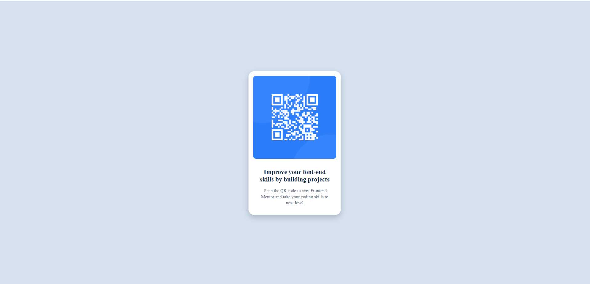

# Frontend Mentor - QR code component solution

This is a solution to the [QR code component challenge on Frontend Mentor]
## Table of contents

  - [Screenshot](#screenshot)
  - [Links](#links)
- [My process](#my-process)
  - [Built with](#built-with)
  - [What I learned](#what-i-learned)
  - [Continued development](#continued-development)
- [Author](#author)


### Screenshot



### Links

- Solution URL: [Add solution URL here](https://your-solution-url.com)
- Live Site URL: [Add live site URL here](https://your-live-site-url.com)


### Built with

- Semantic HTML5 markup
- CSS custom properties
- Flexbox


### What I learned

```html i learned how do add a font from google
 <link rel="preconnect" href="https://fonts.googleapis.com">
    <link rel="preconnect" href="https://fonts.gstatic.com" crossorigin>
    <link href="https://fonts.googleapis.com/css2?family=Outfit:wght@700&display=swap" rel="stylesheet">
    <link href="https://fonts.googleapis.com/css2?family=Outfit&display=swap" rel="stylesheet">
```
```css and its my first time using these properties
    letter-spacing: 0.2px;
    line-height: 140%;
```


### Continued development

I want to work on more responsive css , I liked that worked on mobile display 


## Author

- Website - [wejdene haji](https://www.your-site.com)
- Frontend Mentor - [@yourusername](https://www.frontendmentor.io/profile/yourusername)

